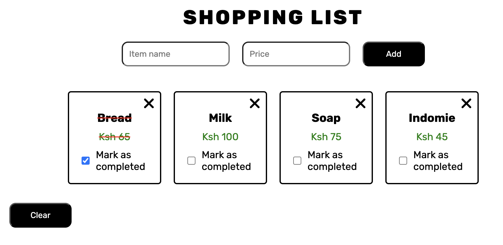

# Interactive-Shopping-List
The project is a shopping list maker where users can add items along with their prices. It helps keep track of the items you plan to buy and those you've already purchased.




## Input section
We collect user input through the items and prices input boxes. We also incorporated validators to ensure that data cannot be submitted unless both input fields are filled.

```html
<form id="input">
    <input id="item" type="text" placeholder="Item name" required>
    <input id="price" type="number" placeholder="Price" required>
    <button onclick="add(event)" type="submit">Add</button>
</form>
```

## Capturing user input
We created an empty object that updates with user content only when data is provided. Capturing data also triggers the display of the 'Clear' button. Afterward, we clear the input fields to allow for additional entries while simultaneously updating the array that tracks all the shopping items.
``` javascript
	    let obj = {}
        if (itemName && price) {
        const obj = {
            itemName: itemName,
            price: price
        }
        shoppingListArr.push(obj)
```
We ended the function by appending all the added elements and returning the shopping list container

``` javascript
label.appendChild(checkbox);
label.appendChild(document.createTextNode(' Mark as completed'));
leftContainer.appendChild(label);
newItemContainer.appendChild(closeButton);
newItemContainer.appendChild(leftContainer);
return (shoppingContainer.appendChild(newItemContainer))
```

## Purchased event listener
One of the project requirements was to ensure users could track the items they’ve already purchased and those they still need to buy. We achieved this by using a checkbox and dynamically adding a strikethrough to distinguish between the two categories.
``` javascript
function handleCheckboxClick (checkbox, h3, p) {
    if (checkbox.checked){
        h3.classList.add('complete')
        p.classList.add('complete')
    } else {
        h3.classList.remove('complete')
        p.classList.remove('complete')
    }
}
```

## Edit existing list items.
Here, we allow users to remove items if they input them incorrectly or change their mind about purchasing. We achieve this by using a function to find the respective item. If found, the item is filtered out of the original array, and the item container is also removed from the DOM.
```javascript
function removeShoppingItem (newItemContainer, itemName, price) {
    const found = shoppingListArr.find(item => item.itemName === itemName && item.price === price);

    if (found) {
        shoppingListArr = shoppingListArr.filter(item => !(item.itemName === itemName && item.price === price));
        newItemContainer.remove();
    }
}
```

## Clear
The idea here is that when users are done shopping, they can either clear the list or create a new one. We achieve this by clearing the array containing the list items, emptying the shopping container in the DOM, and hiding the button.
```javascript
function clearAll() {
    shoppingListArr = [];
    const shoppingContainer = document.querySelector('.shoppingcontainer')
    shoppingContainer.innerHTML = '' // Clears all child elements
    const clearButton = document.getElementById('clear');
    clearButton.classList.add('display');
}
```
Here is the [Link](https://elijah-cod.github.io/Interactive-Shopping-List/) to access the project
